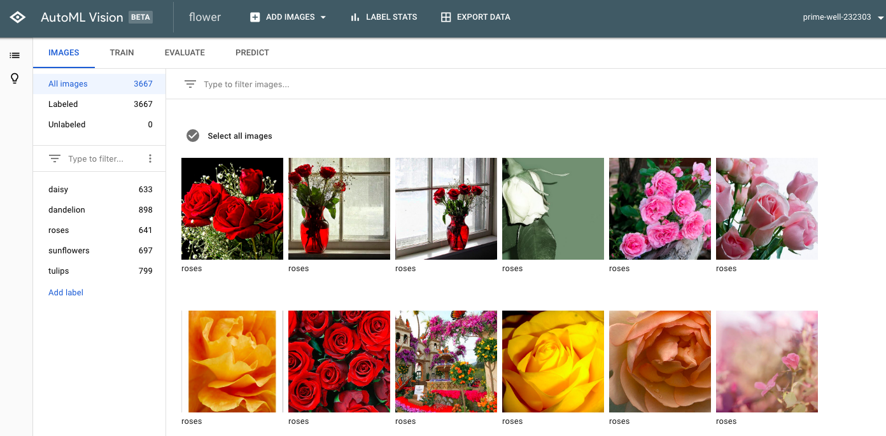

# GCP AutoML & GCP Vision API

### Goal
This project aims to explore and apply AutoML and Vision API in Google Cloud Platform for flower classification.

### Conclusion
This project uses AutoML and Vision API to predict the labels for flowers based on flower images. Compared with sklearn machine learning algorithms, AutoML and Vision API are much more efficient and user-friendly. AutoML detects custom labels and categories from user-trained image models, while Vision API detects board objects and scenes from images. This label detection makes image searchable across board topics and scenes. Thus, AutoML is wrapped in the Vision API layer, and Vision API is a more abstract layer of AutoML.
